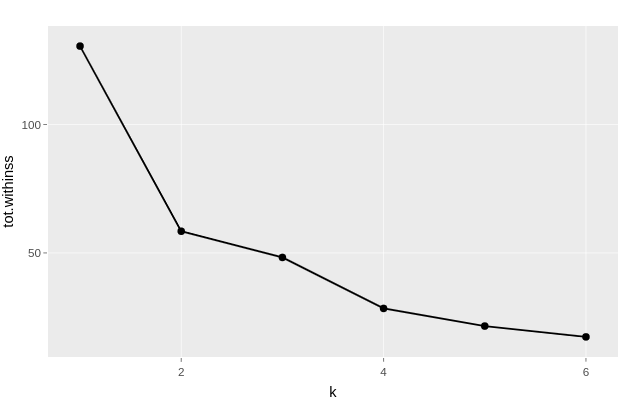
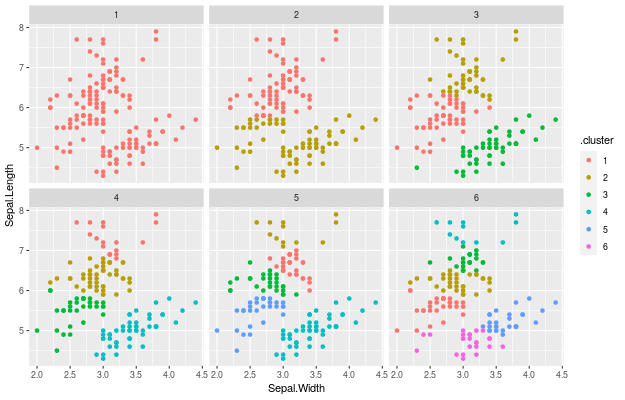
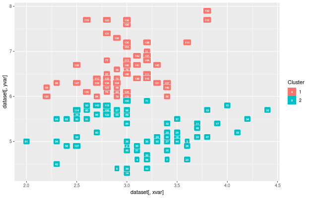

# Clustering

Die aktuelle Version unserer Möglichkeiten zum Clustering bieten zwei verschiedene Funktionen: 

* Bestimmen der optimalen Cluster-Anzahl 

* Darstellen der entsprechenden Cluster (nach gegebener Anzahl)

Das bedeutet, dass es dieser Teil unserer Applikation die Möglichkeit bietet die Anzahl von verschiedenen Ähnlichkeitsstrukturen (Gruppen) in einem Datensatz zu bestimmen und anschließend zu visualisieren. 

#### Bestimmen der Clusteranzahl 

Zum Bestimmen der Clusteranzahl gibt man zunächst die x- sowie die y-Variable an und klickt anschließend auf `Anzahl bestimmen`. 

Nachfolgend bekommt man einen Plot auf dem man die "optimale" Cluster-Anzahl ablesen kann. 

Auf diesem Plot sieht man, dass der größte Abstieg von k=1 auf k=2 besteht, was bedeutet, dass in diesem Fall k=2 die optimale Clusteranzahl ist. 

#### Darstellen der erstellten Cluster

Hat man mit dem vorigen Schritt die "optimale" Clusteranzahl bestimmt, kann man mit der nächsten Funktion die entsprechenden Cluster grafisch darstellen. 

Dazu wählt man zunächst `Analyse` im Drop-Down-Menü aus und gibt die x- und y-Variable sowie die Clusteranzahl ein. 

Anschließend bekommt man einerseits eine Grafik, die anzeigt wie eine Aufteilung mit verschiedenen Werten für die Clusteranzahl aussehen würde. 

Anderseits bekommt man eine Grafik, die die Aufteilung der Datenpunkte in die entsprechende Anzahl von Clustern zeigt. 

