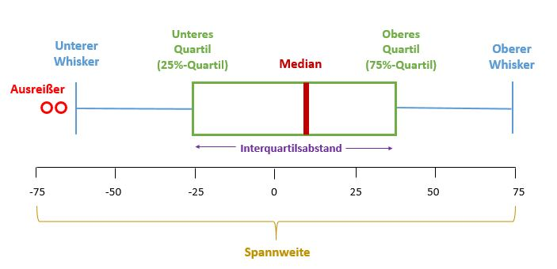
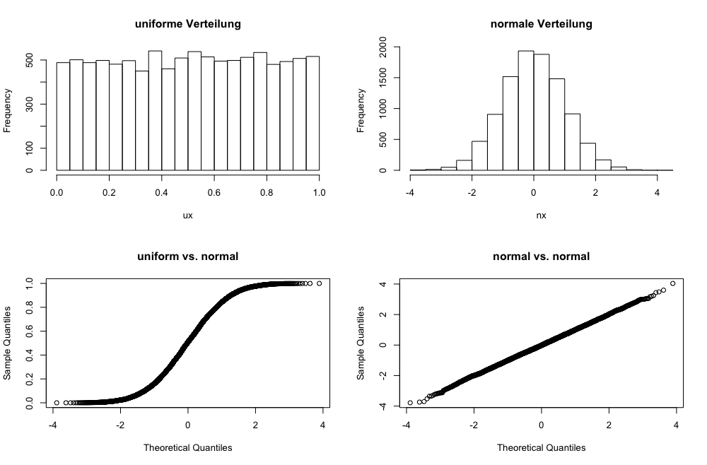
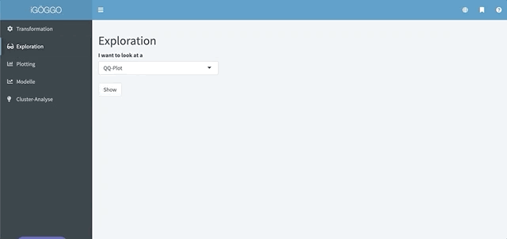
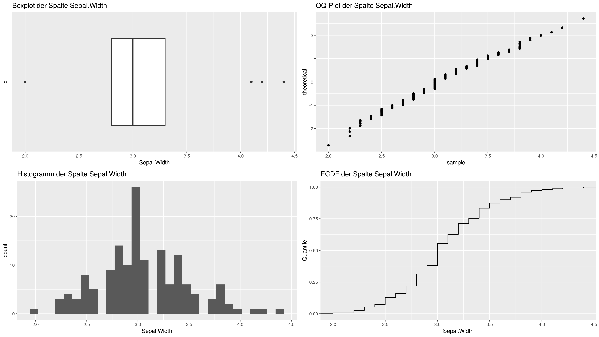

# Exploration

Der Teil unserer des iGÖGGO, der zur Exploration verwendet werden kann, beinhaltet folgende Funktionen, die es ermöglichen sich einen Überblick über einen Datensatz zu verschaffen: 

* Boxplot,
* Histogramm,
* QQ-Plot und
* ECDF-Plot.

Die Exploration soll dazu dienen, ein Gefühl für die Lage einer numerischen Spalte zu bekommen. Fragen wie: "Sind meine Messungen normalverteilt?", oder: "Sind im Datensatz Ausreißer vorhanden", lassen sich mit den unten angeführten Funktionen leicht beantworten.

Alle nachfolgenden Funktionen befinden sich im `Exploration` Tab

### Boxplot

Auf einem Boxplot sind bestimmte Dinge leicht ersichtlich: Beginnen tut er beim niedrigsten Wert der im Datensatz vorkommt. Dieser wird auf der horizontalen Achse aufgetragen und durch einen vertikalen Strich gekennzeichnet. Der nächste Wert stellt das erste Quartil (Q1) da. Das Q1 ist der Punkt, wo 25% der Messungen unter dem entsprechendem X-Wert liegen. Außerdem ist hier der Beginn der Box, die für den Boxplot namensgebend ist. Innerhalb der Box, nicht unbedingt in der Mitte, befindet sich ein vertikaler Strich, der die Box in zwei Teile trennt. Dieser Strich ist der Median. Im Bereich zwischen Q1 und dem Median liegen 25% der Messwerte, unter dem Median liegen 50% der Werte, über dem Median die andere Hälfte. Die Box endet beim Q3 (75% Percentil) und der letzte Wert des Boxplots ist wiederum der höchste, der in der gesamten Spalte vorkommt. Sind Ausreißer vorhanden, dann beginnen und enden die Whisker (so werden die Linien links und rechts der Box auch genannt) nicht beim niedrigsten/höchsten Wert, sondern überlicherweise bei einer Distanz die der Boxbreite * 1.5 entspricht. 

Im iGÖGGO kann ein Boxplot ganz leicht erstellt werden, hierzu muss man auf den `Exploration` Tab gehen und im Dropdown die `Boxplot` Funktion auswählen. Mit dem `Add` Knopf kann man ein neues Boxplot Fenster hinzufügen.

In diesem Fenster lässt sich eine numerische Spalte des geladenen Datensatz auswählen. Wenn die Spalte nicht richtig erkannt wird, dann löschen Sie das Boxplot Fenster und weisen der Spalte unter dem Transformationstab den korrekten Datentypen zu.

**Wichtig**: Der iGÖGGO erlaubt es Ihnen verschiedene Datensätze zu vergleichen. Es reicht daher nicht, wenn Sie nur den korrekten Datentyp im Transformationstab zuweisen, da der iGÖGGO glaubt sie wollen einen Vergleich anstellen. Daher: Boxplot-Fenster löschen, Datentyp richtig zuweisen, neues Fenster erstellen und Boxplot plotten.

Standardmäßig ist im Dropdown Menü die erste numerische Spalte, die vom iGÖGGO erkannt wurde ausgewählt. Hat man die darzustellende Spalte ausgewählt, kann man durch Klicken des Plot-Buttons den entsprechenden Plot erstellen.

Auf Wunsch lässt sich eine Linie am Mittelwert einblenden. Hierfür einfach in den Controls das Häkchen "Linie am Mittelwert" setzten. 

Leider kann man am Boxplot nicht direkt erkennen, ob die numerische Spalte mehrere Modi hat. 

### Histogramm

Im iGÖGGO lassen sich Histogramme kinderleicht erstellen. Bei einem Histogramm wird der Bereich zwischen dem höchsten und niedrigsten Wert der Spalte in `bins` verschiedene Teile geteilt. Die Höhe des Balkens in dem Bereich gibt Aufschluss darüber, wie viele Oberservationen in diesen Bereich fallen. Bei einer normalverteilten Spalte erwartet man sich, dass das Histogramm optische Ähnlichkeiten mit einer Glockenkurve aufweist. 

Wie beim Boxplot auch, schlägt Ihnen der iGÖGGO nur numerische Spalten vor. Scheint eine Spalte im Dropdown nicht auf, verfahren Sie bitte wie im Kapitel `Boxplot` beschrieben.

In den Histogram-Einstellungen können Sie über einen Slider die Anzahl der `bins` beeinflussen. Klicken Sie nochmals auf den `Plot` Button, damit Ihre Einstellungen übernommen werden. Bei Bedarf lässt sich eine Linie am Mittelwert einblenden.  Mit dem Histogram können Sie auf einen Blick erkennen, wie die Lage (= die Verteilung) Ihrer Daten ist. 

### QQ-Plot

Der QQ-Plot hat eine sehr spezielle Aufgabe. Bei einem Quantil-Quantil-Plot wird eine *echte* numerische Spalte gegen eine theoretische Verteilung geplottet. Zumeist ist die theoretische Verteilung eine Normalverteilung und man kann am QQ-Plot erkennen, ob die echte Spalte auch normalverteilt ist. Eine theoretische Verteilung und eine echte Spalte haben die gleiche Verteilung, wenn die Punkte des QQ-Plots perfekt auf der Diagonale des Plots liegen. 

Hört sich alles sehr kompliziert an, doch wie so oft kann eine simple Grafik alles erklären. Im Bild welches Sie unten sehen, wurden zuerst eine uniforme Verteilung und danach eine normale Verteilung generiert. Beim jeweiligen Histogram lassen sich die typischen Formen erkennen. Der QQ-Plot des iGÖGGO hat als Referenzverteilung eine Normalverteilung, daher fo lgt die Linie "uniform vs. normal "nicht der Diagonale. Wir schließen daraus, dass die Daten der uniformen Verteilung nicht normalverteilt sind *(Ja, Sie haben recht: Wenn man eine uniforme Verteilung generiert und sich dann freut, dass man auch mit einem Plot beweisen kann, dass es sich tatsächlich um eine uniforme Verteilung handelt, dann ist das etwas redundant)*. Folgen die Punkte der Diagonale, dann Wissen wir, dass die vorhandenen Daten normalverteilt sind. 

Im iGÖGGO lässt sich ein QQ-Plot wie unten gezeigt erstellen:

### 

### Ecdf-Plot

Der ECDF ist eine kumulative Form des Histogram. Hier wird nicht pro Bereich betrachtet, wie viele Observationen in diesen Bereich fallen, sondern wie viele Teile der Observationen schon vor besagtem X-Wert waren. Daher ist die Skalierung des ECDF Plot auch anders als beim Histogramm: Die X-Achse ist von $x_{min} \space bis \space x_{max}$ skaliert, während die Y-Achse zwischen 0 und 1 verläuft. Die Erstellung eines ECDF-Plots funktioniert im iGÖGGO gleich wie die anderen Plot-Arten.

### Vierplot-Ansicht

Die Vierplot Ansicht erstellt von einer numerischen Spalte die vier Plots die oben angeführt wurden. Die VP-Ansicht ist *die Methode* um Datenexploration im iGÖGGO durchzuführen, weil die Schwächen einer Visualisierungsart (z.B. Am Boxplot ist keine Multimodalität zu erkennen) direkt durch eine andere Visualisierungsart ausgebügelt werden können.

