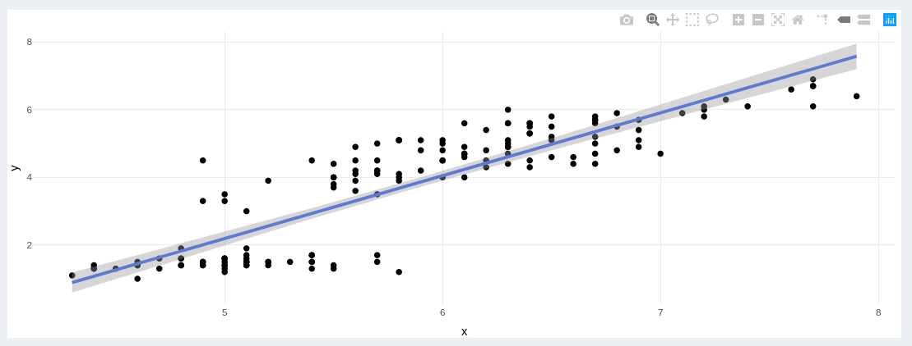
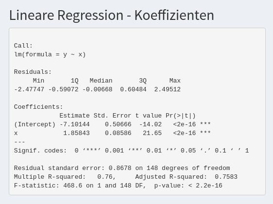
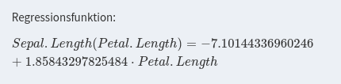
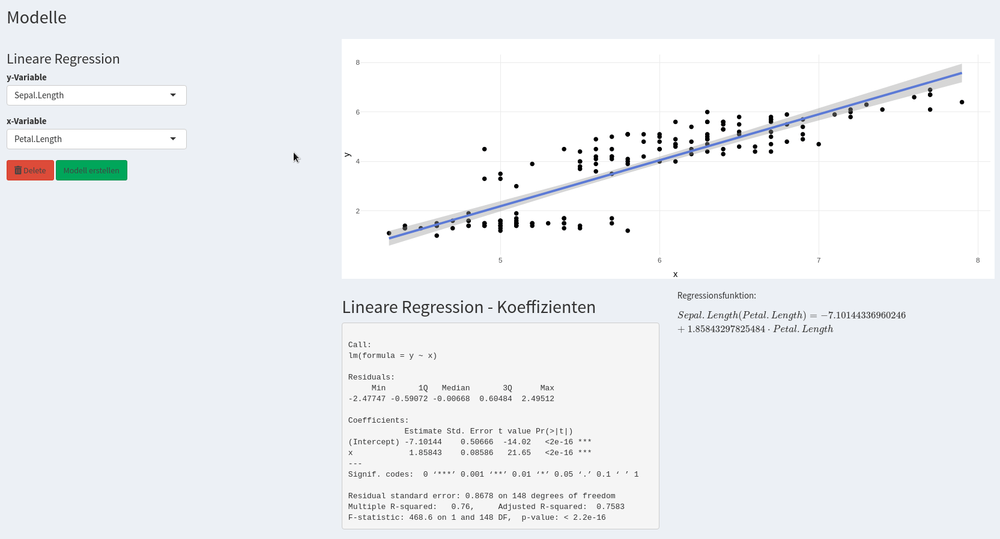

# Modellierung

Unter dem Punkt **Modelle** hat man als Benutzer die Möglichkeit folgende Modelle zu erstellen: 

* lineare Regression
* nicht-lineare Regression (Funktion x-ten Grades)
* Regression mittels Exponentialfunktion
* Regression mittels Log 

## Lineare Regression 

Im Folgenden wird der Ablauf für die Erstellung eines linearen Regressionsmodells beschrieben. 

Zunächst muss im Drop-Down-Menü ausgewählt werden, dass man eine `lineare` Regression wünscht: 

Danach muss man die entsprechende Variable für die y- und die x-Werte angeben.  

Klickt man nun auf den Button `Modell erstellen`, bekommt man sowohl eine grafische Darstellung der tatsächlichen Daten und des Modells als auch einen Output mit den einzelnen Kennzahlen des Modells. Außerdem wird auch die Regressionsfunktion angegeben. 

Sollte bereits ein Modell erstellt sein, kann man dieses natürlich mittels Änderung der Variablen anpassen: 

## Nicht-Lineare Regression 

Im Folgenden wird der Ablauf für die Erstellung eines nicht-linearen Regressionsmodells beschrieben. 

Zunächst muss im Drop-Down-Menü ausgewählt werden, dass man eine `nicht-lineare` Regression wünscht: 

BILD

Danach muss man die entsprechende Variable für die y- und die x-Werte sowie den Grad der Regressionsfunktion angeben.  

Klickt man nun auf den Button `Modell erstellen`, bekommt man sowohl eine grafische Darstellung der tatsächlichen Daten und des Modells als auch einen Output mit den einzelnen Kennzahlen des Modells. Außerdem wird auch die Regressionsfunktion angegeben. 

BILD

Sollte bereits ein Modell erstellt sein, kann man dieses natürlich mittels Änderung der Variablen oder Änderung des Grades anpassen: 

GIF

## logistische Regression 

Im Folgenden wird der Ablauf für die Erstellung eines nicht-linearen Regressionsmodells beschrieben. 

Zunächst muss im Drop-Down-Menü ausgewählt werden, dass man eine `nicht-lineare` Regression wünscht: 

BILD

Danach muss man die entsprechende Variable für die y- und die x-Werte sowie den Grad der Regressionsfunktion angeben.  

Klickt man nun auf den Button `Modell erstellen`, bekommt man sowohl eine grafische Darstellung der tatsächlichen Daten und des Modells als auch einen Output mit den einzelnen Kennzahlen des Modells. Außerdem wird auch die Regressionsfunktion angegeben. 

BILD

Sollte bereits ein Modell erstellt sein, kann man dieses natürlich mittels Änderung der Variablen oder Änderung des Grades anpassen: 

