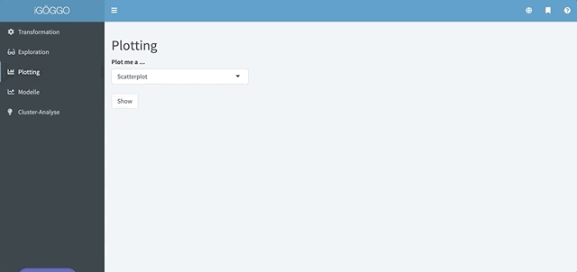

# Plotting

Mit dem iGÖGGO kann man folgende Plots erstellen:

+ Scatterplot
+ Mosaicplot
+ Häufigkeiten
+ Lineplot

Beim Plotting geht es darum Informationen aus mehreren Spalten zusammenzuführen, um Trends zu erkennen und Zusammenhänge ersichtlich zu machen. 

Alle der genannten Funktionen befinden sich am `Plotting` Tab

### Scatterplot

Der Scatterplot (dt. Streudiagramm) ist die Methode um visuell Korrelation zwischen zwei Spalten festzustellen. Vorsicht: Nur weil eine starke Korrelation zwischen zwei Werte herrscht bedeutet das noch nicht, dass tatsächlich ein kausaler Zusammenhang besteht. 

Im iGÖGGO erstellen Sie einen Scatterplot durch die Angabe von zumindest zwei numerischen Spalten des geladenen Datensatz. Vorsicht: Damit ein Punkt gezeichnet wird müssen sowohl die X als auch die Y Koordinate vorhanden sein. Ist einer der beiden Werte Null wird der Punkt nicht gezeichnet. 

Die Einstellungen des Scatterplots bieten Ihnen sehr viele Möglichkeiten:

+ `Form` ist ein Dropdown bei dem sie optional eine kategoriale Spalte angeben können. Statt Punkten erscheinen im Scatterplot dann verschiedene Formen und in der Legende wird eine Zuordnung zwischen Form und der entsprechenden Kategorie ersichtlich
+ `Farbe`: Hier können Sie eine kategoriale Spalte angeben. Die Punkte (oder Formen) werden entsprechend der Kategorie der sie angehöhren gefärbt. In der Legende wird die Zuordnung ersichtlich.
+ `Ausdehnung` bietet Ihnen die Möglichkeit die Information aus einer weiteren numerischen Spalte in den Plot einfließen zu lassen. Die Größe der Punkte wird dann anhand des numerischen Wert der jeweiligen Observation bestimmmt. In der Legende wird ersichtlich, welche Größe für welchen numerischen Wert steht
+ `log x` skaliert die X-Achse logarithmisch
+ `log y` skaliert die Y-Achse logarithmisch
+ `alpha` ist für die Deckkraft der Punkte relevant. Sollten Sie sehr viele Observationen in Ihrem Datensatz haben, so kann es passieren, dass der Plot einfach nur wie ein Meer aus Punkten aussieht. Hier bietet es sich, an die Deckkraft der Punkte zu reduzieren - an jenen Stellen die danach immer noch Dunkel sind, sind sehr viele Punkte vorhanden.

Seien Sie sich bitte bewusst, dass Sie nicht von all diesen Optionen Gebrauch machen müssen. Sie Laufen sonst Gefahr den Plot visuell zu überladen. Wenn Ihnen der iGÖGGO bei Form und Farbe keine Auswahl vorschlägt, dann hat er keien Spalte als kategoriale Spalte erkannt. Gehen Sie dann bitte zurück zum Tab `Transformation` und weisen der Spalte die korrekte Designation zu. 

### 

### Häufigkeiten

Der Häufigkeiten Plot ist der Weg, wie Sie ein klassisches Balkendiagramm erstellen können. Übergeben müssen Sie dieser Funktion eine Spalte mit den Kategorien und eine die entsprechenden assoziierten Werte beinhaltet. In den Einstellungen können Sie auswählen ob sie den Plot `absolut`, `relativ` oder `prozentuell` skaliert haben wollen. In den Einstellungen haben Sie desweiteren die Option die Häufigkeiten als Kreisdiagram darzustellen. Kreisdiagramme sind immer prozentuell skaliert. 

### Mosaicplot

Der Mosaicplot ist eine mächtige Visualisierungsart sofern in Ihrem Datensatz mehrere kategoriale Spalten vorhanden sind. Durch die Angabe von 2-5 kategorialen Variablen können Sie einen Mosaicplot im iGÖGGO erstellen. Sie können sich einen Mosaicplot wie ein Balkendiagramm welches die Kategorie und die jeweilige Anzahl der Observationen darstellt vorstellen, doch anstatt, dass nur eine Kategorie verwendet wird werden 2-5 Kategorien verwenden und die Größe des Vierecks ist der Anteil der Werte für welche diese spezifische Kategorie-Kombiantion zutrifft relativ zu allen Observationen. 

### Lineplot

Der Lineplot ist für zeitliche Abhängigkeiten ideal. Diese Funktion übernimmt eine numerische Spalte und eine Datums/Zeit-Spalte. Eventuell müssen Sie dem iGÖGGO im `Transformation` Tab explitzit sagen, dass es sich bei einer gewissen Spalte um eine Datums/Zeit Spalte handelt. 

Klassiche Beispiele für Lineplots sind Aktienpreise. 

