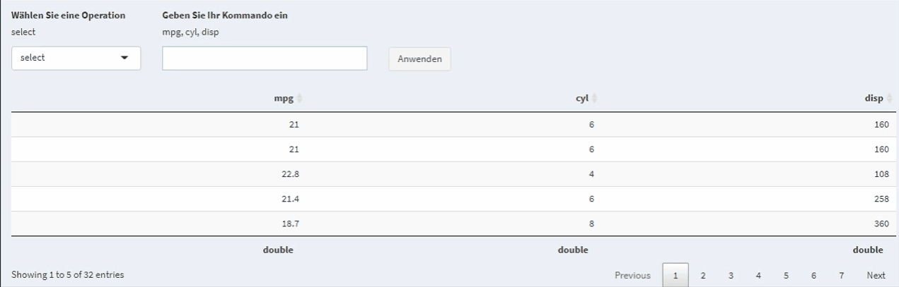
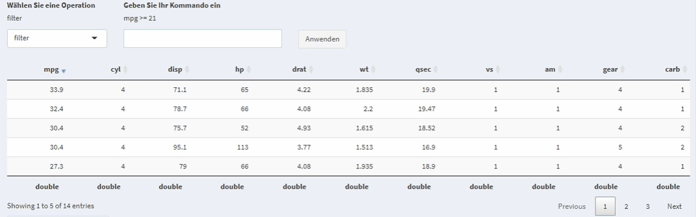

# Transformation

Um den Datensatz (intern od. importiert) nachträglich (nach dem ETL-Prozess) zu transformieren, bietet unsere Applikation mehrere Möglichkeiten: 

* Filtern einzelner Spalten
* Auswählen einzelner Spalten 
* Gruppieren nach diversen Merkmalen 
* Mutieren von Spalten
* Ändern von Spaltennamen 
  * einzeln 
  * gesamt 
* Ändern von Datentypen 
  * Kategorien ergänzen 
* Anwenden von Aggregatfunktionen 

Alle genannten Transformationen können auf dem Tab `Transformation` durchgeführt werden. 

###  Auswählen bestimmter Spalten

Wenn nur bestimmte Spalten in der weiteren Analyse relevant sind, dann kann man diese mit der `select` Operation direkt auswählen. Prinzipiell ist bei dem Operations-Dropdown `select` zu wählen und dann in dem Textfeld die Spalten, durch `, (Beistrich)` getrennt anzugeben.

Anhand des Datensatz`mtcars` soll gezeigt werden wie man mit `select` die Spalten `mpg, cly und disp` auswählt. 

Man kann auch gewisse Spalten exkludieren, also alle außer die angegeben Spalten auswählen. Hierzu sollte man in die Textbox `NOT spalte1, spalte2, spalte3, ...` schreiben.

Das Auswählen von bestimmten Spalten ändert die Zeilenanzahl des Datensatz nicht. Exkludierte Spalten können nicht wiederhergestellt werden.

### Filtern von Spalten

Der iGÖGGO erlaubt es Spalten zu filtern. Numerische Spalten sind durch die Operationen `>, >=, ==, < und <=` filterbar, während kategorielle Variablen entweder mit direkten Vergleichen über `spalte == "Wert" ` oder durch Mengenvergleiche `spalte %in% c("Wert1", "Wert2", "Wert3")`. 

(Kategorielle Filterung Anhand vom `iris` Datensatz)

Die `filter` Operation reduziert die Anzahl der vorhandenen Spalten, sofern einige Spalten die entsprechende Bedingung nicht erfüllen.

Sie können durch die logischen Operatoren `&` und `|` auch zusammengefügte `filter`-Anweisungen erstellen (z.B. `filter mpg < 20 & cyl >= 6`)

Ihnen stehen mit dem iGÖGGO prinzipiell noch mehr `filter`-Möglichkeiten zur Verfügung. Die Funktionen `min(spalte)` und `max(spalte)` sind neben vielen anderen auch unterstützt. Für mehr Filter Möglichkeiten können Sie die `dplyr`-Dokumentation zum Thema unter diesem [Link](https://dplyr.tidyverse.org/reference/filter.html) erreichen.

### Mutieren von Spalten

Der iGÖGGO erlaubt es Ihnen neue Spalten anhand von vorhandenen zu erstellen. Ein Beispiel soll veranschaulichen: Der `mtcars` Datensatz hat eine Spalte `mpg` (Miles per Gallon, Meilen pro Gallone) . `mpg` erfasst für jede Zeile (jedes Automodell) wie viele Meilen (1.609km) pro Gallone (3.785l) gefahren werden können. Für Amerikaner mag dieses Maß aussagekräftig sein, Europäer verwenden jedoch meist l/100km. Durch die `mutate`-Operation kann man jedoch von `mpg` auf `l/100km` schließen.

Diese Problem lässt sich in einige kleinere Probleme zerlegen, diese sind

+ von `mpg` auf `kmpg` rechnen (`mpg*1.609`)
+ von `kmpg` auf `kmpl` rechnen (`kmpg/3.785`)
+ von `kmpl` auf `lp100km` rechnen (`100/kmpl`)

Hört sich vielleicht etwas kompliziert an, ist es aber nicht. 

Es sind zwei Lösungsvarianten angeführt, eine step-by-step Lösung und eine *Oneliner* Lösung.

Der *Oneliner* geht wie folgt: `lp100km_one_line = 100/((mpg*1.609)/3.785)`. Alternativ hätte man sich auch einfach den Umrechnungsfaktor googeln können und hätte `lp100km = 235/mpg` schreiben können.

Die Möglichkeiten sind nicht auf eine Spalte beschränkt. Man könnte z.B. mit einem Datensatz der Gewicht und Körpergröße speichert dem BMI durch `mutate bmi = gewicht/koerpergroesse^2` berechnen. (Natürlich nur sofern `gewicht` in der Einheit kg und `koerpergroesse` in der Einheit m vorliegt. Wenn dem nicht so ist kann man durch den `mutate`-Befehl die entsprechenden Spalten jedoch ganz einfach hinzufügen). Auch mit "String" Spalten kann man Mutationen durchführen. Dies ist besonders praktisch wenn man konsolidierte Kategorien erreichen will. Der Absatz `Gruppieren und Zusammenfassen` wird von dieser Pratik gebrauch machen. 