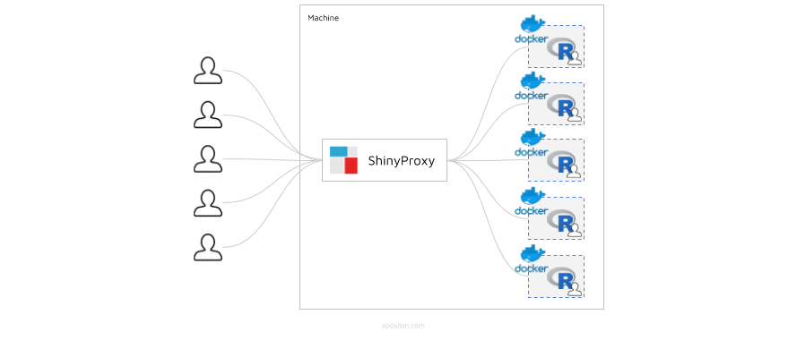

# R-Shiny Server mit Docker und ShinyProxy

Dieses Tutorial befasst sich mit dem Deployment des iGÖGGO. Welche Parameter man verändern kann und wie man die Applikation für mehrere Benutzer zur Verfügung stellt wird ebenfalls angeführt.

## Voraussetzungen

Für das Deployment sind zwei Programme notwendig: Docker und Java.

### Docker

Docker ist eine Virtualisierungssoftware, welche den iGÖGGO ausführt. Um es zu installieren sind folgende Befehle notwendig [9].

```shell
apt-get install \
    apt-transport-https \
    ca-certificates \
    curl \
    gnupg \
    lsb-release
    
curl -fsSL https://download.docker.com/linux/ubuntu/gpg | sudo gpg --dearmor -o /usr/share/keyrings/docker-archive-keyring.gpg

echo \
  "deb [arch=amd64 signed-by=/usr/share/keyrings/docker-archive-keyring.gpg] https://download.docker.com/linux/ubuntu \
  $(lsb_release -cs) stable" | sudo tee /etc/apt/sources.list.d/docker.list > /dev/null
  
apt-get update

apt-get install docker-ce docker-ce-cli containerd.io
```

Danach muss der Docker-Daemon auf dem Port 2375 laufen. Dazu muss in der Datei `/lib/systemd/system/docker.service` folgende Zeile abgeändert werden.

Aus 

```shell
ExecStart=/usr/bin/dockerd -H fd://
```

wird

```shell
ExecStart=/usr/bin/dockerd -H fd:// -D -H tcp://127.0.0.1:2375
```

Danach muss der Service neu gestartet werden.

```shell
systemctl daemon-reload
systemctl reload docker
```

Nun ist Docker fertig konfiguriert und einsatzbereit. Um Docker ohne `sudo` ausführen zu können ist es notwendig, den Benutzer in die `docker`-Gruppe hinzuzufügen.

```shell
usermod -aG docker <benutzername>
```

Danach ist ein Neustart des Rechners notwendig, bzw. muss sich die Benutzerin aus- und wieder einloggen.

Um die Installation zu testen kann `docker run hello-world` ausgeführt werden. Folgende Ausgabe ist zu erwarten:

```shell
Hello from Docker!
This message shows that your installation appears to be working correctly.

To generate this message, Docker took the following steps:
 1. The Docker client contacted the Docker daemon.
 2. The Docker daemon pulled the "hello-world" image from the Docker Hub.
    (amd64)
 3. The Docker daemon created a new container from that image which runs the
    executable that produces the output you are currently reading.
 4. The Docker daemon streamed that output to the Docker client, which sent it
    to your terminal.

To try something more ambitious, you can run an Ubuntu container with:
 $ docker run -it ubuntu bash

Share images, automate workflows, and more with a free Docker ID:
 https://hub.docker.com/

For more examples and ideas, visit:
 https://docs.docker.com/get-started/
```

Wenn Sie diese Ausgabe sehen, haben Sie Docker richtig installiert.

### Java

Java ist eine Programmiersprache, welche zum Bereitstellen des iGÖGGO für mehrere Benutzer benötigt wird. Es wird Java 11 empfohlen, da das Entwicklerteam damit arbeitet.

```shell
apt-get install openjdk-11-jdk
```

 Die Installation kann mit `java -version` überprüft werden. Sie sollten so etwas wie 

```
openjdk version "11.0.10" 2021-01-19
OpenJDK Runtime Environment (build 11.0.10+9)
OpenJDK 64-Bit Server VM (build 11.0.10+9, mixed mode)
```

sehen.

## Deployment 
Der iGÖGGO kann lokal aufgesetzt werden, oder auf der Testplattform Heroku [4]. Dazu ist unser GitHub-Repository zu clonen. Unter bestimmten Versionen von Linux kann es passieren, dass die `.sh`-Dateien beim Clonen ihre Berechtigungen verlieren. In diesem Fall kann man im `deployment`-Ordner den Befehl `sudo chmod +x *.sh` ausführen. Damit lassen sich alle Skripte ausführen.

### Lokales Deployment

Im Verzeichnis `diplomprojekt/deployment` können Sie einfach folgenden Befehl ausführen.

```shell
sh deploylocal.sh <port>
```
Mit dem Parameter `port` wird spezifiziert, auf welchem HTTP-Port der iGÖGGO gestartet wird. Zum Beispiel startet `sh deployment.sh 3838` den iGÖGGO auf `http://localhost:3838`.

Mit `curl` wird am Ende des Skriptes überprüft, ob alles funktioniert hat und der Container läuft.

```shell
curl -v --silent localhost:<port> --stderr - | grep '<header class="main-header">'
```

Nachdem das Skript gestartet wurde ist der iGÖGGO unter `localhost:<port>` erreichbar.

### Deployment mit ShinyProxy

Da ein einzelne Instanz des iGÖGGO nur von einer Benutzerin verwendet werden kann empfiehlt sich ein Skalieren der Anwendung mit einem Loadbalancer. Dieser stellt jeder Benutzerin einen Container zur Verfügung.

 

Diese Funktionalität wird von ShinyProxy bereits zur Verfügung gestellt [7]. Wir stellen ein Skript zur Verfügung, welches ShinyProxy startet und dann über `http://localhost:8080` erreichbar ist.

```shell
sh deploylocalproxy.sh
```

Da eine Authentifizierung notwendig ist, weil ShinyProxy anhand des eingeloggten Benutzers skaliert, haben wir uns für eine simple Authentifizierung entschieden. Im `application.yml` kann unter dem Tag `users` eine Liste mit Benutzern angegeben werden. **Wichtig** ist, dass die Benutzer Teil der Gruppe `goeg_employee` sind, da sie sonst nicht auf den iGÖGGO zugreifen können. So könnten zwei Benutzer aussehen:

```yaml
users:
	- name: max
	  password: supersicher
	  groups: goeg_employe
	- name: miriam
	  password: sicherer
	  groups: goeg_employee
```

Natürlich ist dies nicht die sicherste Methode, Nutzerdaten zu speichern. ShinyProxy ermöglicht es, sich über einen LDAP-Server zu authentifizieren, eine genaue Beschreibung kann der offiziellen Website entnommen werden [8].

#### Initialisieren und Zurücksetzen der Bookmark-Datenbank

Vor dem ersten Starten der Applikation mit ShinyProxy ist die `reset.sh` auszuführen. Sie erstellt eine Verzeichnisstruktur in `/var/lib/igoeggo`, welche die Bookmarks und die Bookmark-Datenbank enthält. Möchte man den Inhalt der Datenbank und die Bookmarks zurücksetzen, also **löschen**, kann diese Datei erneut ausgeführt werden.


### Cloud-Deployment mit Heroku

Ein Deployment der Software über Heroku ist denkbar einfach. Wieder gibt es ein Skript, `deploy.sh`, welches Sie auffordert, sich bei Heroku anzumelden, und das iGÖGGO-Dockerfile auf Heroku lädt. Das Installieren können Sie über das Heroku-Log beobachten. Natürlich spielt sich das ganze wieder im Verzeichnis `diplomprojekt/deployment` ab.

```shell
sh deploy.sh
```

Das `deploy.sh`-Skript lädt automatisch auf die Applikation `igoeggo`. Hat man seine eigene Applikation, muss das Skript entsprechend angepasst werden. Folgende Zeilen sind zu bearbeiten.

```shell
heroku container:push web --app <app_name>
heroku container:release web --app <app_name>
until heroku logs --app <app_name> --source app | grep -q "shiny-server - Starting listener"; do
```

Sollte man noch keine Heroku-App haben, muss man sie mit `heroku create <app_name>` in der Kommandozeile erstellt werden.

## Quellen und hilfreiche Links

[1] *verwendetes docker-hub image* https://hub.docker.com/r/rocker/shiny (Accessed June 2nd 2020)

[2] *einfache shiny-applikation* https://shiny.rstudio.com/tutorial/written-tutorial/lesson1/ (Accessed June 2nd 2020)

[3] *docker-compose reference guide* https://docs.docker.com/compose/compose-file/ (Accessed June 2nd 2020)

[4] *heroku* https://heroku.com (Accessed January 13th 2021)

[5] *official Dockerfile reference* https://docs.docker.com/engine/reference/builder/ (Accessed January 13th 2021)

[6] *official docker-compose.yaml reference (v3)* https://docs.docker.com/compose/compose-file/compose-file-v3/ (Accessed January 13th 2021)

[7] *official website of ShinyProxy* https://shinyproxy.io/ (Accessed March 17th 2021)

[8] *configure LDAP with ShinyProxy* https://shinyproxy.io/documentation/configuration/#ldap (Accessed March 17th 2021)

[9] *docker installation instruction* https://docs.docker.com/engine/install/ubuntu/ (Accessed March 17th 2021)